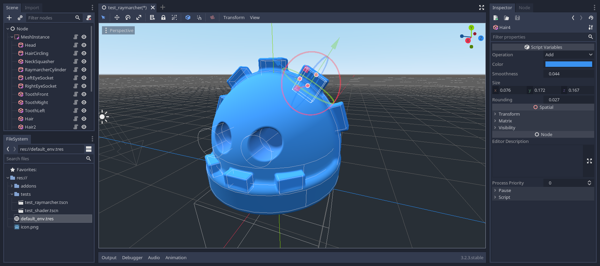

SDF Blender plugin for Godot Engine
========================================

This plugin allows to create 3D models by blending simple shapes together, using Signed Distance Fields rendered with raymarching.

Advantages:
- The result is fully detailed, because shapes are procedural and no polygons are involved.
- It is much more natural to build organic structures, thanks to configurable smooth blending.
- Coloring is procedural too so no need to UV-map
- Some transformations such as symmetry or repetition can be made without extra cost
- Everything is dynamic so you can go back adjusting parameters anytime. You can also animate them at no extra cost, contrary to CSG.

Downsides:
- Rendering is slower when the model becomes complex or instanced many times, so it should be used with moderation.
- The amount of dynamic parameters may be limited by how many `uniform` a shader can have on your graphics card
- No shadows. This might be a problem to solve in Godot's renderer, to make depth-writing shaders work with shadow maps
- No PBR materials... yet. Just colors.
- No transparency
- No antialiasing

Note, this plugin is mostly for toying around with Signed Distance Fields and see how well it could be integrated. It might not be suited for most games, however SDF has been used elsewhere, such as Unity plugin [Clayxels](https://assetstore.unity.com/packages/tools/game-toolkits/clayxels-165312), or even [Dreams](http://dreams.mediamolecule.com/), a game where such concept empowers players to create 3D content. So I think it has potential :)

Installing
------------

This is a regular editor plugin.
Copy the contents of `addons/zylann.sdf_blender` into the same folder in your project, and activate it in your project settings.

Usage
-------

- Create a `SDFContainer` node
- Add shapes as children (`SDFSphere`, `SDFCylinder`, `SDFTorus`...)
- Shapes will be blended in the order they appear in the tree.
- Visuals might disappear if you look away from the origin of the `SDFContainer`. This is because Godot still "thinks" the container is a small 2x2 quad. To fix this, increase `extra_cull_margin`. In the future the plugin might be able to compute this automatically.
